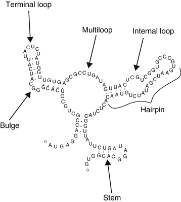

# Predicting mRNA Degradation for Vaccine Development
The [Das Lab at Stanford](https://daslab.stanford.edu/) has provided experimental results to better understand how the RNA sequence determines its degradation rates. RNA vaccines are relatively unstable and require storage at -80C temperatures.  

## Dataset
* 2400 RNA molecule training set. Length 107 base pairs.
* Inputs
  * `sequence`: RNA sequence 'AUGCAGUAUC...'
  * `structure`: sequence like '(((...)))...((..(..)).)' where '(' and ')' are paired bases and '.' is unpaired.
  * `predicted_loop_type`: sequence like 'EEESSISSSBBSHHHSSSXX...' for the estimated structural context (Loop, Hairpin Loop, Stem, etc.)
  * `bpps`: Base Pairing Probability Matrix. Probability that position $i$ pairs with position $j$.   
* Outputs
  * `reactivity`: array of floats for measure reactivity at each position
  * `deg_Mg_ph10`: similar to `reactivity` when in a magnesium solution at pH 10.
  * `deg_Mg_50C`: similar to `reactivity` when in a magnesium solution at 50C.
  * Only the first 68 positions used for public set and first 91 positions used for private set
    

## Approach
* **Extract features** from the Base Pairing Matrix
* **Filter and weight** samples by signal-to-noise ratio.
* **Augment the data** by generating secondary structural annotations for each RNA sequence and adding reversed sequences. 
* **Group similar sequences** in cross-validation folds
* Use **denoising autoencoder** with for pre-training
* Use Base Pairing Matrix to aggregate neighborhoods and combine with Bidirectional LSTM layers.
